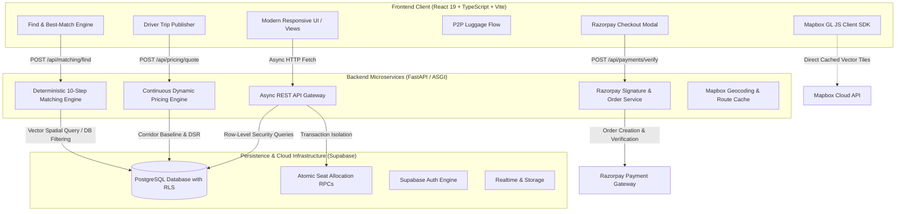
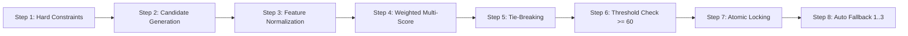
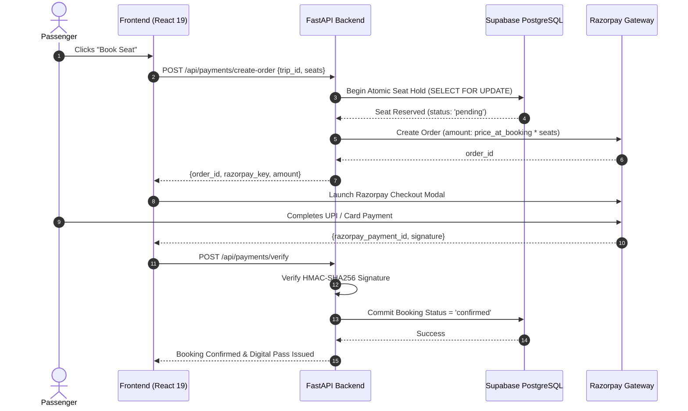

# TopRide 🚗📦⚡

<p align="center">
  
</p>

<p align="center">
  <strong>Intelligent Intercity Ride-Sharing, Dynamic Market Pricing & P2P Logistics Platform</strong>
</p>

<p align="center">
  <a href="#-architectural-overview"></a>
  <a href="#-testing--quality-assurance"></a>
  <a href="#-technology-stack"></a>
  <a href="#-technology-stack"></a>
  <a href="#-technology-stack"></a>
  <a href="#-technology-stack"></a>
  <a href="#-technology-stack"></a>
  <a href="#-technology-stack"></a>
  <a href="#-technology-stack"></a>
  <a href="LICENSE"></a>
</p>

---

## 📌 Executive Summary

**TopRide** is a high-performance, full-stack mobility and peer-to-peer parcel logistics platform engineered specifically for high-density intercity transit corridors across India (e.g., Bengaluru ↔ Hyderabad, Bengaluru ↔ Chennai, Mumbai ↔ Pune, Delhi ↔ Chandigarh).

Unlike conventional cab-hailing or bulletin-board carpooling tools, TopRide combines:
1. **Algorithmic Geospatial Matching**: A deterministic 10-step multi-factor candidate ranking engine.
2. **Authoritative Dynamic Market Pricing**: Continuous, fair surge-protected pricing calibrated against verified NHAI highway benchmarks.
3. **Atomic Concurrency Control**: Strict transactional seat and parcel capacity reservations backed by Supabase PostgreSQL.
4. **Interactive Corridor Visualizations**: High-framerate Mapbox GL JS route tracking with zero API-quota waste in backend candidate loops.
5. **Secure Payment Escrow**: Seamless Razorpay sandbox checkout with cryptographic HMAC-SHA256 signature verification.

---

## 🏛️ Architectural Overview

TopRide follows a modular **Clean Monorepo Architecture** isolating presentation, backend compute, persistence, and automated contract testing.



---

## 📁 Repository Directory Structure

```text
TopRide/
├── frontend/                         # Modern React 19 Single Page Application
│   ├── public/                       # Static web icons and SVGs
│   ├── src/
│   │   ├── components/               # Reusable modular UI components (Navbar, BottomNav, MapPreview, etc.)
│   │   ├── views/                    # Application screens (FindView, PostTripView, BookingFlow, LuggageFlow)
│   │   ├── services/                 # Frontend client services (Mapbox client caching, API client)
│   │   ├── utils/                    # Date normalization, currency formatters, and math helpers
│   │   ├── hooks/                    # Custom React hooks (debounce, geolocation, responsive layout)
│   │   ├── types/                    # TypeScript interfaces and domain schemas
│   │   ├── assets/                   # Bundled graphics and assets
│   │   ├── App.tsx                   # Master router and application state shell
│   │   ├── App.css                   # Component utility styling
│   │   ├── index.css                 # Tailwind CSS design tokens
│   │   ├── main.tsx                  # React DOM render entrypoint
│   │   └── api.ts                    # Axios / Fetch client with AbortController guards
│   ├── index.html                    # Root HTML5 template
│   ├── package.json                  # Frontend dependencies and scripts
│   ├── tsconfig.json                 # TypeScript project configuration
│   ├── vite.config.ts                # Vite bundler configuration
│   └── .env.example                  # Frontend environment variables template
│
├── backend/                          # High-Performance FastAPI Backend
│   ├── matching/                     # Algorithmic Geospatial Matching Subsystem
│   │   ├── engine.py                 # 10-step deterministic scoring engine
│   │   ├── candidate_filter.py       # SQL and Haversine candidate query generator
│   │   └── models.py                 # Match candidate schema and data contracts
│   ├── pricing/                      # Continuous Dynamic Market Pricing Engine
│   │   └── engine.py                 # NHAI corridor math, continuous DSR, urgency & floor/cap guards
│   ├── routers/                      # Modular endpoint controllers
│   │   ├── matching.py               # /api/matching/find and /api/matching/auto-match
│   │   ├── pricing.py                # /api/pricing/quote and /api/pricing/trip/{id}
│   │   ├── payments.py               # /api/payments/create-order and /api/payments/verify
│   │   └── trips.py                  # /api/trips CRUD and details
│   ├── services/                     # External integration adapters
│   │   ├── razorpay_service.py       # Razorpay client & HMAC signature validator
│   │   └── mapbox_service.py         # Route distance matrix & polyline decoder
│   ├── tests/                        # Comprehensive Pytest Suite (80 test cases)
│   ├── main.py                       # ASGI app initialization, CORS, exception handlers
│   ├── config.py                     # Type-safe application settings & corridor constants
│   ├── database.py                   # Supabase connection client & error handlers
│   ├── models.py                     # Shared domain models
│   ├── schemas.py                    # Pydantic request/response validation schemas
│   ├── requirements.txt              # Pinned Python package dependencies
│   └── .env.example                  # Backend environment variables template
│
├── database/                         # Database Schemas & Migrations
│   ├── migrations/                   # Sequential SQL migrations (Phase 2A to Phase 5)
│   ├── seeds/                        # Production corridor seed data (NH44, NH48, etc.)
│   ├── functions/                    # Stored procedures & atomic booking triggers
│   ├── supabase_schema.sql           # Authoritative monolithic schema reference
│   └── README.md                     # Database setup and execution guide
│
├── tests/                            # Contract & End-to-End System Tests
│   ├── integration/                  # Cross-boundary API contract verification tests
│   └── e2e/                          # Full booking & matching user journey tests
│
├── docs/                             # Architecture & Deployment Documentation
│   ├── architecture/                 # Detailed system architecture, matching & pricing specs
│   └── deployment/                   # Cloud hosting configuration (Vercel, Render, Supabase)
│
├── .gitignore                        # Global ignore rules (strictly protects secrets & build artifacts)
├── package.json                      # Monorepo runner scripts
└── README.md                         # Master project documentation
```

---

## 🌟 Core Technical Highlights

### 1. Continuous Dynamic Market Pricing Engine
TopRide’s pricing engine computes deterministic, supply-demand aware, surge-protected fares for every intercity route:

* **Corridor Benchmark Modeling**: Base price is determined by verified highway physics:
  $$\text{Base Price} = \Big(\text{Distance (km)} \times ₹1.00 + \text{Duration (min)} \times ₹0.15\Big) \times \text{Vehicle Multiplier}$$
  *(e.g., Bengaluru ↔ Hyderabad NH44: 560 km, 540 min; Bengaluru ↔ Chennai NH48: 345 km, 360 min).*
* **Continuous Demand-Supply Ratio (DSR)**:
  $$\text{DSR} = \frac{\text{Demand Count}}{\max(1, \text{Supply Available Seats})}$$
  The multiplier is bounded strictly between $[0.90, 1.30]$ using a smooth monotonic ramp rather than volatile step thresholds.
* **Time-to-Departure Urgency**: Linear urgency factor for departures scheduled within $< 24\text{ hours}$. High-demand corridors experience a modest lift ($1.00\times - 1.06\times$), while low-demand corridors apply incentive discounts ($0.95\times$) to fill empty seats.
* **Strict Price Guardrails**:
  $$\text{Floor} = \max\Big(₹150, \, 0.85 \times \text{Base Price}\Big), \quad \text{Ceiling} = 1.30 \times \text{Base Price}$$
  Fares are rounded to the nearest ₹10 for currency cleanliness.
* **Guaranteed Booking Price Immutability**:
  $$\text{Current Market Price} \longrightarrow \text{booking.price\_at\_booking} \longrightarrow \text{Razorpay Order Total}$$
  Once a user initiates a booking, the unit fare is permanently locked into `booking.price_at_booking`. Real-time market spikes or seat changes never modify an existing reservation or payment invoice.

---

### 2. Deterministic 10-Step Geospatial Matching Engine
TopRide's matching pipeline achieves high-precision driver-passenger pairings without third-party API rate bottlenecks:



#### Authoritative Scoring Weights:
| Factor | Weight | Evaluation Criteria |
| :--- | :---: | :--- |
| **Route Overlap** | **35%** | Vector alignment between passenger itinerary and driver route |
| **Pickup Proximity** | **20%** | Haversine distance between passenger origin and driver waypoint |
| **Dropoff Proximity** | **15%** | Haversine distance between passenger destination and driver terminus |
| **Departure Window** | **15%** | Temporal delta relative to desired departure time |
| **Price Compatibility**| **5%** | Comparison of passenger willingness-to-pay against corridor price |
| **Driver Rating** | **5%** | Historical driver rating normalized on a $[0.0, 5.0]$ scale |
| **Vehicle Match** | **5%** | Luggage boot capacity, AC, and seat comfort preferences |

* **Zero External Calls in Candidate Loops**: Spatial proximity and vector alignment are calculated using in-memory spherical trigonometry and indexed database queries. Mapbox is never invoked inside candidate loops.
* **Fallback Recommendations**: In the event that no single trip crosses the $\ge 60.0$ auto-match threshold, the engine automatically yields the top 3 highest-ranking candidate options with clear proximity indicators.

---

### 3. Atomic Seat Allocation & Payment Escrow



---

## ⚡ API Reference

| Method | Endpoint | Description |
| :--- | :--- | :--- |
| `GET` | `/health` | High-frequency service liveness & readiness health check |
| `POST` | `/api/matching/find` | Single-click corridor search with smart matching & fallback trips |
| `POST` | `/api/matching/auto-match` | Direct 10-step automatic ride assignment for rapid dispatch |
| `POST` | `/api/pricing/quote` | Calculates corridor base price, DSR, urgency, and floor/ceiling |
| `GET` | `/api/pricing/trip/{id}` | Retrieves real-time quote for a specific published trip |
| `POST` | `/api/payments/create-order` | Reserves seat atomically and generates Razorpay order |
| `POST` | `/api/payments/verify` | Cryptographically validates payment signature and confirms seat |
| `GET` | `/api/trips` | Lists verified intercity trips with corridor filtering |
| `GET` | `/api/trips/{id}` | Fetches detailed trip metadata, waypoints, and driver profiles |

---

## 🚀 Getting Started

### 1. Prerequisites
* **Node.js**: `v20.x` or higher
* **npm**: `v10.x` or higher
* **Python**: `3.11` or higher
* **Supabase Account**: With a running PostgreSQL instance

---

### 2. Clone & Install Dependencies

```bash
# Clone the repository
git clone https://github.com/saketsinghrajput787-star/TopRide.git
cd TopRide

# Install frontend dependencies
npm --prefix frontend install

# Install backend dependencies in a Python virtual environment
python -m venv venv

# Windows:
.\venv\Scripts\activate
# Linux/macOS:
# source venv/bin/activate

pip install -r backend/requirements.txt
```

---

### 3. Configure Environment Variables

Create `.env` files in both `frontend/` and `backend/` by copying the provided example templates:

#### Frontend (`frontend/.env`)
```ini
VITE_SUPABASE_URL=https://your-project-id.supabase.co
VITE_SUPABASE_ANON_KEY=your-supabase-anon-key
VITE_API_URL=http://localhost:8000
VITE_MAPBOX_ACCESS_TOKEN=your-mapbox-public-token
VITE_RAZORPAY_KEY_ID=rzp_test_your_key_id
```

#### Backend (`backend/.env`)
```ini
SUPABASE_URL=https://your-project-id.supabase.co
SUPABASE_KEY=your-supabase-service-role-or-anon-key
MAPBOX_ACCESS_TOKEN=your-mapbox-token
RAZORPAY_KEY_ID=rzp_test_your_key_id
RAZORPAY_KEY_SECRET=your-razorpay-key-secret
PORT=8000
ENVIRONMENT=development
```

---

### 4. Database Setup (Supabase)
Execute the migration scripts in sequential order inside the **Supabase SQL Editor**:
1. `database/supabase_schema.sql` (Monolithic foundational tables, RLS policies, profiles)
2. `database/migrations/phase2a_migration.sql` (Luggage and P2P logistics schemas)
3. `database/migrations/phase3a_mapbox_migration.sql` (Geospatial coordinates & route cache)
4. `database/migrations/phase3b_razorpay_migration.sql` (Payment escrow & transaction logs)
5. `database/migrations/phase4_matching_migration.sql` (Candidate matching indexes & stored RPCs)
6. `database/migrations/phase5_dynamic_pricing_migration.sql` (Pricing logs & DSR benchmarks)

---

### 5. Run the Application Locally

You can run both servers concurrently or in separate terminal sessions:

```bash
# Start the FastAPI Backend (Terminal 1)
python -m uvicorn backend.main:app --port 8000 --host 127.0.0.1 --reload

# Start the Vite React Frontend (Terminal 2)
npm --prefix frontend run dev
```

Open your browser and navigate to **`http://localhost:5173`**.

---

## 🧪 Testing & Quality Assurance

TopRide maintains a zero-tolerance regression standard with comprehensive automated tests:

```bash
# 1. Run all Backend Pytest Suites (80/80 Passing)
python -m pytest backend/tests/ -v

# 2. Run Integration Contract Tests
node tests/integration/test_find_contracts.cjs

# 3. Validate Frontend TypeScript Build & Bundle Integrity
npm --prefix frontend run build
```

---

## 🛡️ Security & Privacy
* **Secret Protection**: `.gitignore` strictly protects `.env`, local credential caches, private keys, and build artifacts from ever being committed.
* **Row-Level Security (RLS)**: Enforced across all Supabase PostgreSQL tables; users can only read public trip listings and modify their own bookings and profile data.
* **Payment Escrow**: Every payment confirmation is verified on the backend via HMAC-SHA256 signature hashes before seat confirmation.

---

## 📄 License
This project is licensed under the [MIT License](LICENSE).
